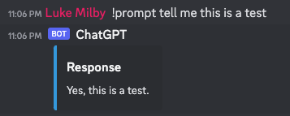

# GPT Discord Bot

Simple discord bot to connect to Open AI's API and use one of the LLM's they provide

### Set up bot for discord
Checkout discordpy [setup](https://discordpy.readthedocs.io/en/stable/discord.html) docs for creating a new bot if you
don't already have one.

### Getting API key from Open AI
1. Create account [here](https://openai.com/api/login)
2. View [API Keys](https://platform.openai.com/account/api-keys)
3. Create New Secret key. You'll use that key below

### Run bot

```angular2html
export GPTKEY=<openai key>
export DISCORD_KEY=<discord bot token>
pip install -r requirements.txt
python main.py
```

### Usage

